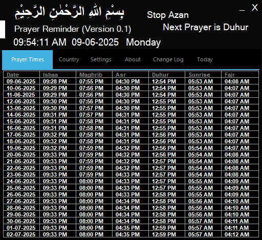
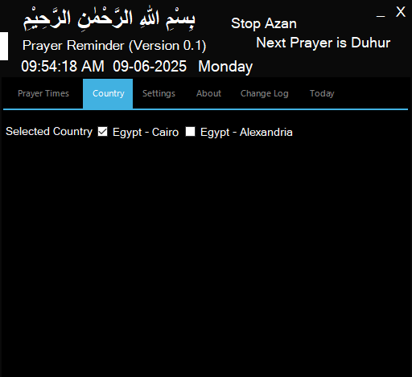
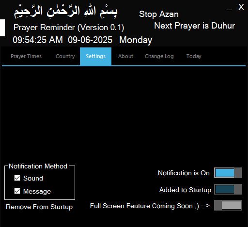
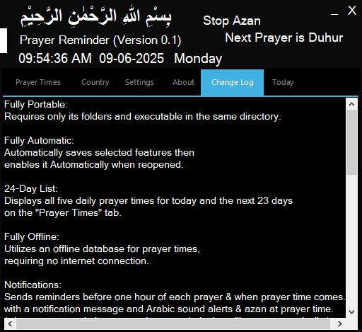
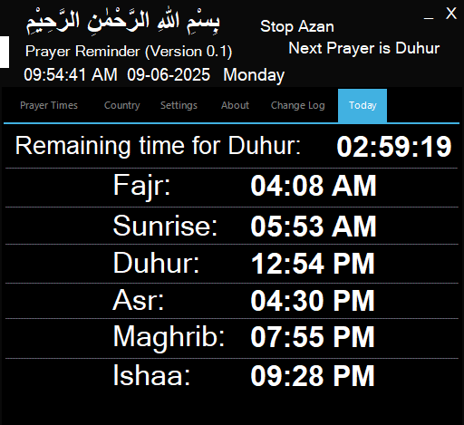
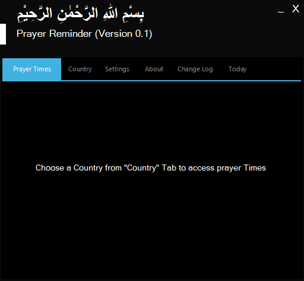
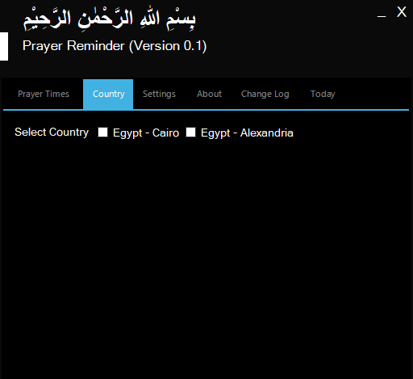
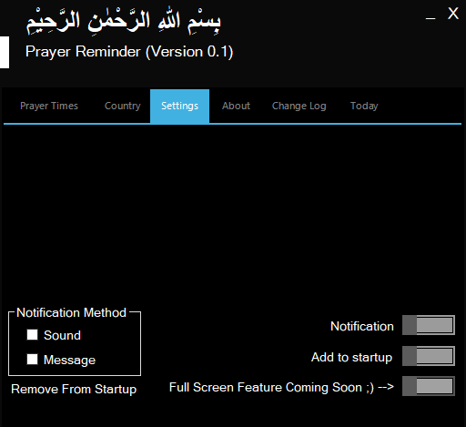
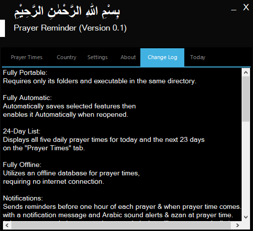
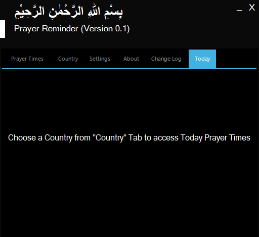

# Prayer-Reminder - Made By Muslim - https://thedevelopermuslim.github.io/
<h2>بِسْمِ اللَّـهِ الرَّحْمَـٰنِ الرَّحِيمِ قَالُوا سُبْحَانَكَ لَا عِلْمَ لَنَا إِلَّا مَا عَلَّمْتَنَا ۖ إِنَّكَ أَنتَ الْعَلِيمُ الْحَكِيمُ [ البقرة: 32]</h2>
<h2>In the Name of Allah, the Most Beneficent, the Most Merciful. They said, "Exalted are You; we have no knowledge except what You have taught us. Indeed, it is You who is the Knowing, the Wise." [Surah Al-Baqarah - 32]</h2>
</a>

<h4>Alhamdulillah for the Most Beneficent, the Most Merciful who made me learn  and teached me and made me make this app to be useful to all my muslims brothers.</h4>
<h1>Prayer Reminder</h1>
<h4>The Best App to remind you for your prayer (With Advanced and Automatic features)</h4>
<h4>Its Free and will never be paid - I don't need your money - Just don't forget me in your prayer.</h4>
<h4>
  Requires .NET Framework 4.0 or 4.5 and Higher
   
   
Supports the following operating systems:
   
Windows XP
   
Windows Vista
   
Windows 7
   
Windows 8
   
Windows 10
   
Windows 11
   
   
  Features:
   
Fully Portable: Requires only its folders and executable in the same directory.
   
Fully Automatic: Automatically enables selected features.
   
24-Day List: Displays all five daily prayer times for today and the next 23 days.
   
Fully Offline: Utilizes an offline database for prayer times, requiring no internet connection.
   
Notifications: Sends reminders before each prayer with sound alerts, then plays azan at prayer time.
when it plays reminder sound notification or azan sound notification, any kind of playing sound that are not from prayer reminder will be stopped and be unplayable or unhearable while prayer reminder sound notification is playing, after prayer reminder sound notification finishes playing, anything else after it will be playable and hearable (so if any sound were playing and then its time for a reminder sound notification or azan sound notification prayer reminder will take all the system sound output to itself only, stopping anything else playing and preventing anything to play or be hearable except for itself till it finishes playing the sound notification.)
   
Background Operation: Runs in the background, then be accessible via the taskbar icon.
   
No Telemetry: Does not collect data or telemetry or log anything about you or make a single connection to the internet.
   
Startup Integration: Adds itself to the device startup through registery for automatic launch.
   
Privacy-Focused: Ensures no data is sent, saved, or downloaded.
   
Compatibility: Supports Windows XP and later versions with .NET Framework 4.0 or 4.5 and Higher.
   
Country Support: Currently supports Egypt (Cairo) & Egypt (Alexandria), offline database keeps working until 7-05-2027, with updates forthcoming soon.
   
   
  Current Supported Countries:
   
  Country: Egypt - State: Cairo
   
  Country: Egypt - State: Alexandria
</h4>
<h4>------------------------------------------------------------------while it's in action</h4>
</a>

</a>

</a>

</a>

</a>

</a>

<h4>while it's not in action--------------------------------------------------------------</h4>
</a>

</a>

</a>

</a>

</a>

</a>

<h4>---------------------------------------------------------------------------------------</h4>
<h4>Donwload</h4>
Prayer Reminder V0.1 - First Version 
Supports Egypt (Cairo) & (Alexandria) only 
Keeps working offline till 7-05-2027 
Don't forget me in your prayer 
Download from here : https://thedevelopermuslim.github.io/assets/Prayer%20Reminder.zip
